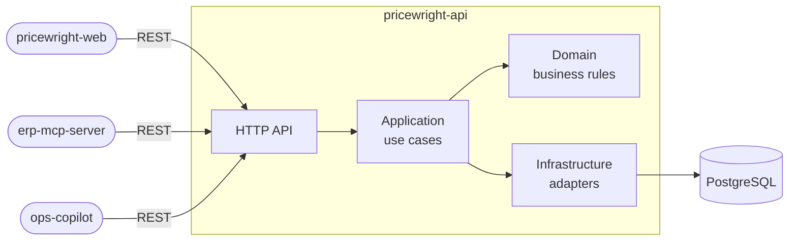

# Pricewright API

> Multi-tenant B2B quote-to-order API: transparent pricing engine, approval workflow and full audit
> trail.

[](https://github.com/odvprogra/pricewright-api/actions/workflows/ci.yml)
[](https://codecov.io/gh/odvprogra/pricewright-api)
[](.python-version)
[](LICENSE)

> Pricewright and its demo tenants, Northfield Supply and Larkspur Tool Co., are fictional
> companies.

## Demo

Not deployed yet. A live demo with seeded data and demo credentials comes with M8; until then,
[run it locally](#run-it-locally) and use the interactive API docs at `http://localhost:8000/docs`.

## The problem

B2B distributors quote prices by hand in spreadsheets. Discounts are inconsistent from one sales rep
to the next, margins leak, large discounts get approved over chat with no trace, and a sent quote
can't be tied to the order that came out of it. Pricewright centralizes quoting: a pricing engine
that explains every price, an approval workflow for discounts that need one, and an audit trail from
the first quote to the order.

## What it does

Pricewright is built in milestones; this table shows what works today. The full scope is in the
[product brief](docs/brief.md).

| Capability                                                                               | Milestone | Status |
| ---------------------------------------------------------------------------------------- | --------- | ------ |
| Service baseline: Problem Details errors, request IDs, health checks, versioned OpenAPI  | M0        | Done   |
| Tenants, users, roles and service accounts with scoped API keys; strict tenant isolation | M1        | Done   |
| Catalog and customers with cursor pagination and audit events                            | M2        | Next   |
| Pricing engine: price waterfall with a per-line breakdown of every rule applied          | M3        |        |
| Quotes with revisions, expiration, approvals and optimistic locking                      | M4        |        |
| Idempotent conversion of accepted quotes into orders                                     | M6        |        |
| Transactional outbox, worker, quote PDFs and email notifications                         | M5        |        |

The web app lives in a separate repository, `pricewright-web` (from M7). It consumes this API the
same way every other client does: through a released `openapi.json`.

## Architecture



Hexagonal-lite: dependencies point inward, the domain is pure Python, and an architecture test
enforces both. Clients never read the code or the database: each one pins a release of this API and
generates its client from the `openapi.json` attached to it. Details in
[docs/architecture.md](docs/architecture.md).

## Key decisions

| Decision                                                                                                          | Why                                                                                        |
| ----------------------------------------------------------------------------------------------------------------- | ------------------------------------------------------------------------------------------ |
| [ADR-0001](docs/adr/0001-record-architecture-decisions.md) Hexagonal-lite, decisions recorded as ADRs             | Business rules testable without infrastructure; reasons survive the people who made them   |
| [ADR-0002](docs/adr/0002-separate-repos-with-a-versioned-openapi-contract.md) Versioned OpenAPI contract          | Every client, the web app included, depends on a released, immutable spec                  |
| [ADR-0006](docs/adr/0006-shared-schema-multi-tenancy.md) Shared-schema multi-tenancy                              | Cheapest model to run; isolation enforced by scoped repositories, composite keys and tests |
| [ADR-0007](docs/adr/0007-authentication-for-users-and-service-accounts.md) Authentication without an external IdP | Standards-based passwords and tokens, and a demo that runs with `docker compose up`        |
| [ADR-0009](docs/adr/0009-not-found-for-other-tenants-resources.md) 404 across tenants                             | An id never confirms that another tenant's record exists                                   |
| [ADR-0011](docs/adr/0011-repository-and-unit-of-work-ports.md) Repository and Unit of Work ports                  | Use cases stay framework-free and testable with fakes; atomic operations are explicit      |
| [ADR-0012](docs/adr/0012-optimistic-concurrency-with-etag-and-if-match.md) ETag + `If-Match`                      | No lost updates: a stale edit is a 412, a missing `If-Match` a 428                         |

## Run it locally

Requires [uv](https://docs.astral.sh/uv/) and [just](https://just.systems/), plus Docker.

```sh
just setup   # dependencies, git hooks, openapi.json
just dev     # PostgreSQL in Docker + migrations, then the API on http://localhost:8000 (docs at /docs)
just check   # lint, types and tests: what CI runs
```

Tenants are onboarded by an operator. With the database up, create one and its first admin (the
password is prompted for, or read from standard input with `--password-stdin`):

```sh
uv run pricewright-admin create-tenant --name "Northfield Supply" --currency USD --tax-rate 0.0725 \n  --admin-email avery@northfield.example --admin-name "Avery Admin"
```

Then sign in at `POST /api/v1/auth/login` and paste the `access_token` into **Authorize** in the
interactive docs; `GET /api/v1/me` shows who you are.

Configuration comes from environment variables; [.env.example](.env.example) documents them.

## Testing strategy

| Level        | Location             | What it covers                                                                         |
| ------------ | -------------------- | -------------------------------------------------------------------------------------- |
| Unit         | `tests/unit`         | Domain rules and application use cases, no I/O                                         |
| Architecture | `tests/architecture` | Import contracts: dependencies point inward, the domain is pure                        |
| Integration  | `tests/integration`  | Adapters against a real PostgreSQL (testcontainers); migrations reversible and in sync |
| API          | `tests/e2e`          | HTTP behavior: Problem Details, request IDs, health, OpenAPI drift                     |

`just test` runs everything with coverage (gate: 80% overall, 95% on the domain in CI). Integration
tests need Docker; `just test -m "not integration"` skips them.

## Project structure

```text
src/pricewright/
├── domain/          # business rules, pure Python
├── application/     # use cases and ports
├── infrastructure/  # adapters: logging, database
├── api/             # FastAPI app, Problem Details, middleware, health
├── settings.py      # configuration from the environment
└── main.py          # composition root
tests/               # unit, architecture, integration, e2e
migrations/          # Alembic
docs/                # product brief, architecture and ADRs
```

## Trade-offs & what I'd do next

- **Identity is built in, not delegated.** Passwords, tokens and API keys follow OWASP, NIST SP
  800-63B-4 and the OAuth security RFCs (ADR-0007), but there is no MFA, no SSO and no rate limiting
  by IP yet; a breached-password blocklist would be the next cheap win. An external identity
  provider (OIDC) can replace sign-in without touching authorization.
- **Admins set initial passwords.** Email invitations arrive with the worker and email in M5.
- **Isolation lives in the application and in composite keys.** PostgreSQL row-level security would
  add a fourth layer (ADR-0006); it stays a stretch goal.
- **`Idempotency-Key`** arrives with orders (M6). Until then the creation endpoints are protected by
  natural keys (a user's email, an account's name).
- **The OpenAPI spec documents errors with FastAPI's default schemas**, not as Problem Details; the
  fix belongs in the service template.
- **No breaking-change check yet.** The oasdiff check against the latest release arrives in M2, with
  the first business endpoints.
- **Deliberately out of scope:** invoicing, inventory, taxes beyond a flat rate per tenant,
  payments, multi-currency conversion and SSO. Each is a product of its own; the integration points
  would be the order snapshot and the outbox events.

## License

[MIT](LICENSE)
