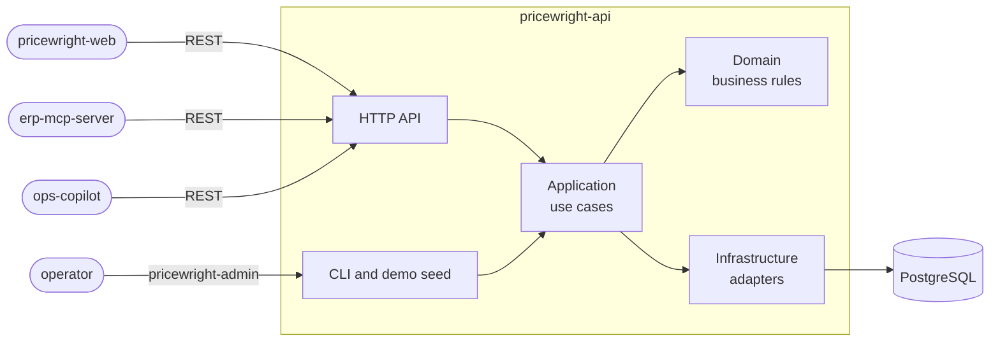

# Pricewright API

> Multi-tenant B2B quote-to-order API: transparent pricing engine, approval workflow and full audit
> trail.

[](https://github.com/odvprogra/pricewright-api/actions/workflows/ci.yml)
[](https://codecov.io/gh/odvprogra/pricewright-api)
[](.python-version)
[](LICENSE)

> Pricewright and its demo tenants, Northfield Supply and Larkspur Tool Co., are fictional
> companies. So are their people and customers.

## Demo

Not deployed yet (a live demo comes with M8). Locally, two commands give you two tenants with six
months of history dated up to today, and the interactive API docs to explore them
([prerequisites](#run-it-locally)):

```sh
just seed   # reset the local database and load the demo data (local and test environments only)
just dev    # the API on http://localhost:8000, interactive docs at http://localhost:8000/docs
```

Every demo user signs in with the passphrase **`pricewright demo`**. It is published on purpose: it
guards fictional data that only exists where the seed may run, and the seed refuses staging and
production ([ADR-0024](docs/adr/0024-demo-data-through-the-use-cases.md)).

| Email                       | Role          | Tenant            | Try                                                       |
| --------------------------- | ------------- | ----------------- | --------------------------------------------------------- |
| `jordan@northfield.example` | Sales rep     | Northfield Supply | Build a quote, submit it, send it, convert it to an order |
| `taylor@northfield.example` | Sales rep     | Northfield Supply | The quotes of Taylor's own accounts                       |
| `casey@northfield.example`  | Sales rep     | Northfield Supply | The quotes of Casey's own accounts                        |
| `morgan@northfield.example` | Sales manager | Northfield Supply | The approval inbox (8 requests waiting), pricing rules    |
| `avery@northfield.example`  | Admin         | Northfield Supply | Users, settings, catalog, the audit trail                 |
| `riley@larkspur.example`    | Sales rep     | Larkspur Tool Co. | Any Northfield id: 404                                    |
| `robin@larkspur.example`    | Admin         | Larkspur Tool Co. | Larkspur's own settings and audit trail                   |

What the data holds (seed 2026; `uv run pricewright-admin seed --help` for another seed or date):

- **Northfield Supply**, a distributor of industrial and office supplies:
  - USD, 7.25% tax, approvals above a 15% discount.
  - 300 products in 8 categories: the products with the most demand in the dataset that
    `demand-forecast` uses, renamed
    ([ADR-0025](docs/adr/0025-northfield-catalog-from-the-demand-dataset.md)).
  - 80 customers (gold, silver, standard) and 13 pricing rules of every kind. One promotion runs
    today, one ended, one is upcoming.
  - 150 quotes from the last six months. Their states:
    - drafts;
    - waiting for approval;
    - approved, sent and accepted;
    - 69 converted into orders, 5 of those orders cancelled;
    - rejected and lost;
    - revised (`-R2`);
    - 12 offers that expired unanswered.
  - Quote numbers `NF-2026-…`, order numbers `NFO-2026-…`.
- **Larkspur Tool Co.**, a small tool supplier: 19 products and 10 quotes. It is there to show that
  tenants never see each other.

Everything was entered through the use cases, as the tenants' people would have: prices, approvals,
numbers and the audit trail are the application's own. The same seed and date always give the same
data.

### From quote to order in the interactive docs

1. **Sign in as the rep.** `POST /api/v1/auth/login` with
   `{"email": "jordan@northfield.example", "password": "pricewright demo"}`. Paste the
   `access_token` into **Authorize**.
2. **Find the customer and the products.**
   - `GET /api/v1/customers?q=C-0013` gives Kestrel Bay Fabrication, a gold account.
   - `GET /api/v1/products?sku=FST-0066` gives the lag screws; `?sku=SAF-0108` gives the
     high-visibility vests.
3. **Create the quote.** `POST /api/v1/quotes` with the customer's id and two lines, 60 boxes of
   screws and 48 vests:

   ```json
   {
     "customer_id": "…",
     "lines": [
       { "product_id": "…", "quantity": "60" },
       { "product_id": "…", "quantity": "48" }
     ]
   }
   ```

   - Each line explains its price: the screws get 12% for volume, then 6% for a gold account; the
     vests get 10%, then 9% from the gold safety program.
   - The quote gives away 17.7%, over the 15% threshold, so `requires_approval` is true.
   - The `ETag` is `"1"`.

4. **Submit it.** `POST /api/v1/quotes/{id}/submit` with `If-Match: "1"`: the quote waits for
   approval. Jordan cannot approve it: 403 (reps do not hold `quotes:approve`, and nobody approves a
   quote they built).
5. **Approve it as the manager.** Sign in as Morgan: `GET /api/v1/approval-requests` lists the
   request with the 8 seeded ones. `POST /api/v1/quotes/{id}/approve` takes the current ETag; an old
   one gets 412.
6. **Close the sale.** Back as Jordan, `send`, then `accept`, then
   `POST /api/v1/quotes/{id}/convert` with `Idempotency-Key: order-1` and
   `{"customer_reference": "PO-12345"}`. The answer is a 201 with an order such as
   `NFO-2026-000070`. Send the same request again: the same order comes back, marked
   `Idempotent-Replayed: true`.
7. **Try it from the other tenant.** Signed in as Riley at Larkspur, `GET /api/v1/quotes/{id}`
   answers 404: another tenant's records do not exist.

The seeded history is there to browse: `GET /api/v1/quotes?status=superseded` for revisions,
`GET /api/v1/orders?status=cancelled`, and, as Avery, `GET /api/v1/audit-events` for who did what
and when.

## The problem

B2B distributors quote prices by hand in spreadsheets. Discounts are inconsistent from one sales rep
to the next, margins leak, large discounts get approved over chat with no trace, and a sent quote
can't be tied to the order that came out of it. Pricewright centralizes quoting: a pricing engine
that explains every price, an approval workflow for discounts that need one, and an audit trail from
the first quote to the order.

## What it does

Pricewright is built in milestones; this table shows what works today. The full scope is in the
[product brief](docs/brief.md).

| Capability                                                                                | Milestone | Status |
| ----------------------------------------------------------------------------------------- | --------- | ------ |
| Service baseline: Problem Details errors, request IDs, health checks, versioned OpenAPI   | M0        | Done   |
| Tenants, users, roles and service accounts with scoped API keys; strict tenant isolation  | M1        | Done   |
| Catalog and customers: search, filters, sorting and cursor pages; money exact to 4 places | M2        | Done   |
| Audit trail: every change with its actor, before/after values and request ID              | M2        | Done   |
| Pricing engine: rules kept by managers; previews that explain every price, step by step   | M3        | Done   |
| Quotes priced line by line, with revisions, expiration, four-eyes approvals and an inbox  | M4        | Done   |
| Orders converted once from accepted quotes; `Idempotency-Key` on every creation           | M6        | Done   |
| Demo data: two tenants and six months of history, loaded through the use cases            | —         | Done   |
| Transactional outbox, worker, quote PDFs and email notifications                          | M5        |        |

The web app lives in a separate repository, `pricewright-web` (from M7). It consumes this API the
same way every other client does: through a released `openapi.json`.

## Architecture



Hexagonal-lite: dependencies point inward, the domain is pure Python, and an architecture test
enforces both. Clients never read the code or the database: each one pins a release of this API and
generates its client from the `openapi.json` attached to it. The demo seed is one more driver of the
use cases, like the HTTP API. Details in [docs/architecture.md](docs/architecture.md).

## Key decisions

| Decision                                                                                                                     | Why                                                                                                 |
| ---------------------------------------------------------------------------------------------------------------------------- | --------------------------------------------------------------------------------------------------- |
| [ADR-0001](docs/adr/0001-record-architecture-decisions.md) Hexagonal-lite, decisions recorded as ADRs                        | Business rules testable without infrastructure; reasons survive the people who made them            |
| [ADR-0002](docs/adr/0002-separate-repos-with-a-versioned-openapi-contract.md) Versioned OpenAPI contract                     | Every client, the web app included, depends on a released, immutable spec                           |
| [ADR-0003](docs/adr/0003-money-as-an-exact-decimal-with-its-currency.md) Money as an exact decimal, rounded half up          | Sub-cent unit prices, no float drift, and rounding that matches invoices, tax and SQL               |
| [ADR-0004](docs/adr/0004-pricing-waterfall-breakdown-and-approval-metric.md) Staged price waterfall, explained per line      | Discounts cascade as in ERPs and CPQs; every price explains itself                                  |
| [ADR-0005](docs/adr/0005-quote-lifecycle-as-a-transition-table.md) Quote lifecycle as a transition table                     | One readable table; revisions supersede; an expired offer acts expired before any job runs          |
| [ADR-0006](docs/adr/0006-shared-schema-multi-tenancy.md) Shared-schema multi-tenancy                                         | Cheapest model to run; isolation enforced by scoped repositories, composite keys and tests          |
| [ADR-0007](docs/adr/0007-authentication-for-users-and-service-accounts.md) Authentication without an external IdP            | Standards-based passwords and tokens, and a demo that runs with `docker compose up`                 |
| [ADR-0009](docs/adr/0009-not-found-for-other-tenants-resources.md) 404 across tenants                                        | An id never confirms that another tenant's record exists                                            |
| [ADR-0011](docs/adr/0011-repository-and-unit-of-work-ports.md) Repository and Unit of Work ports                             | Use cases stay framework-free and testable with fakes; atomic operations are explicit               |
| [ADR-0012](docs/adr/0012-optimistic-concurrency-with-etag-and-if-match.md) ETag + `If-Match`                                 | No lost updates: a stale edit is a 412, a missing `If-Match` a 428                                  |
| [ADR-0013](docs/adr/0013-append-only-audit-events-in-the-same-transaction.md) Append-only audit events                       | Every change commits with its actor, before/after values and request ID, or not at all              |
| [ADR-0014](docs/adr/0014-list-queries-with-whitelisted-filters-sort-and-keyset-cursors.md) Keyset cursors bound to the query | Stable pages under concurrent writes; a cursor reused with other filters is a 422, not a wrong page |
| [ADR-0015](docs/adr/0015-open-ended-values-in-responses.md) Open-ended values in responses                                   | Growing value sets (audit actions, scopes) never break generated clients                            |
| [ADR-0016](docs/adr/0016-catalog-and-customer-master-data.md) Archived, never deleted; keyed by SKU and account number       | Quotes never point at nothing; other systems rely on codes; retries cannot duplicate records        |
| [ADR-0017](docs/adr/0017-costs-only-for-people-with-costs-read.md) Costs only for people (`costs:read`)                      | Integrations, and the LLMs behind them, never see costs or margins                                  |
| [ADR-0018](docs/adr/0018-pricing-rules-typed-scoped-and-effective-dated.md) Pricing rules: typed, scoped, effective-dated    | One table the engine reads at once; the best discount wins without priorities to maintain           |
| [ADR-0019](docs/adr/0019-quote-pricing-snapshot.md) A pricing snapshot per quote line                                        | Drafts reprice on every change; submitted quotes never drift from what was approved and sent        |
| [ADR-0020](docs/adr/0020-quote-approvals-with-four-eyes.md) Approvals decided by four eyes                                   | Nobody approves a discount they set; every decision names who asked, who decided and why            |
| [ADR-0021](docs/adr/0021-quote-numbers-per-tenant-and-year.md) Quote numbers per tenant and year                             | Readable numbers without gaps (`NF-2026-000123-R2`) that never reveal another tenant's volume       |
| [ADR-0022](docs/adr/0022-idempotency-keys-stored-with-the-change.md) Idempotency keys, stored with the change                | A retried creation gets back what the first one made, even with an old ETag; never two of anything  |
| [ADR-0023](docs/adr/0023-orders-converted-once-from-accepted-quotes.md) Orders converted once, prices copied                 | An order is exactly what the customer accepted, and keeps the customer as it was                    |
| [ADR-0024](docs/adr/0024-demo-data-through-the-use-cases.md) Demo data through the use cases, from a seed and a date         | The demo shows the real rules at work; the same seed and day give the same data, never stale        |
| [ADR-0025](docs/adr/0025-northfield-catalog-from-the-demand-dataset.md) A catalog from the demand dataset's top products     | Forecasts map one to one onto products, and no demand data or download is needed to run the demo    |

## Run it locally

Requires [uv](https://docs.astral.sh/uv/) and [just](https://just.systems/), plus Docker.

```sh
just setup   # dependencies, git hooks, openapi.json
just seed    # PostgreSQL in Docker, reset to the demo data (see Demo)
just dev     # PostgreSQL in Docker + migrations, then the API on http://localhost:8000 (docs at /docs)
just check   # lint, types and tests: what CI runs
```

PostgreSQL listens on port 5432. Configuration comes from environment variables;
[.env.example](.env.example) documents them.

Tenants are onboarded by an operator. To start from an empty database instead of the demo, create
one and its first admin (the password is prompted for, or read from standard input with
`--password-stdin`):

```sh
uv run pricewright-admin create-tenant --name "Northfield Supply" --currency USD --tax-rate 0.0725 \
  --admin-email avery@northfield.example --admin-name "Avery Admin"
```

Then sign in at `POST /api/v1/auth/login` and paste the `access_token` into **Authorize** in the
interactive docs; `GET /api/v1/me` shows who you are.

## Testing strategy

| Level        | Location             | What it covers                                                                                  |
| ------------ | -------------------- | ----------------------------------------------------------------------------------------------- |
| Unit         | `tests/unit`         | Domain rules and use cases on in-memory fakes that enforce the adapters' rules, no I/O          |
| Properties   | `tests/unit`         | Hypothesis: invariants over generated rules, quotes, retries and demo data (below)              |
| Architecture | `tests/architecture` | Import contracts (dependencies point inward, the domain is pure); every route has a tenant case |
| Integration  | `tests/integration`  | Adapters against a real PostgreSQL 18 (testcontainers); migrations reversible and in sync       |
| API          | `tests/e2e`          | HTTP behavior: Problem Details, ETags, idempotency keys, request IDs, OpenAPI drift             |

What the riskiest parts are held to:

- **Properties (hypothesis).**
  - For any rules, quantities, currencies and tax rates, totals reconcile: line totals rounded once
    and summed, tax once on the subtotal.
  - A quote state machine never approves, sends or accepts without a decision by someone who did not
    build the quote.
  - An order carries exactly its quote's lines and totals.
  - Retries with any keys, bodies and versions never make a second order.
  - For any seed and date, the demo data keeps every business rule.
- **Concurrency.** Tests hold one side at an `asyncio.Barrier` instead of hoping for a race.
  - Two conversions of one quote make exactly one order.
  - Two requests with the same `Idempotency-Key`: one gets 409 at once, and its retry gets the order
    back.
  - Concurrent quote numbers come out without gaps.
  - Two saves of the same version: one wins.
  - Two admins demoting each other leave one admin.
- **Isolation.**
  - Every route with an id has a case proving that another tenant gets a 404 and changes nothing; a
    guard test fails when a new route has none.
  - Composite foreign keys stop cross-tenant references in the database itself.
- **Demo data.**
  - A load gives exactly the same canonical picture on PostgreSQL as on the fakes.
  - A second load is refused.
  - A reset gives the same data again.

`just test` runs everything with coverage (gate: 80% overall, 95% on the domain in CI; the suite
covers all of it). Integration tests need Docker; `just test -m "not integration"` skips them.

On every pull request, CI also compares `openapi.json` with `main`'s
([oasdiff](https://github.com/oasdiff/oasdiff)): a breaking change fails the check unless the pull
request title marks it with `!`.

## Project structure

```text
src/pricewright/
├── domain/          # business rules, pure Python
├── application/     # use cases and ports
├── infrastructure/  # adapters: database records and repositories, tokens, passwords, logging
├── api/             # FastAPI routers, Problem Details, money JSON, cursors, middleware
├── demo/            # the demo tenants, their catalog file and their history, through the use cases
├── cli.py           # pricewright-admin: create-tenant, seed
├── settings.py      # configuration from the environment
└── main.py          # composition root
scripts/             # development scripts (rebuilding the demo catalog from the dataset)
tests/               # unit, architecture, integration, e2e
migrations/          # Alembic
docs/                # product brief, architecture and ADRs
```

## Trade-offs & what I'd do next

- **Identity is built in, not delegated.** Passwords, tokens and API keys follow OWASP, NIST SP
  800-63B-4 and the OAuth security RFCs (ADR-0007), but there is no MFA, no SSO and no rate limiting
  by IP yet; a breached-password blocklist would be the next cheap win. An external identity
  provider (OIDC) can replace sign-in without touching authorization.
- **Admins set initial passwords.** Email invitations arrive with the worker and email in M5.
- **Isolation lives in the application and in composite keys.** PostgreSQL row-level security would
  add a fourth layer (ADR-0006); it stays a stretch goal.
- **Idempotency keys are kept for 24 hours** and a replay shows the resource as it is now, not the
  first response's bytes (ADR-0022); expired keys stay in their table until the M5 worker purges
  them. Issuing an API key is the one creation without a key: its secret is shown once.
- **Orders stop at the commitment.** One order per accepted quote, copied whole, open or cancelled
  (ADR-0023): no partial conversions, deliveries or invoices. Payment terms come from the customer
  at conversion, since quotes do not carry them yet; a cancelled order's quote cannot convert again.
- **Expiry is computed, not yet stored.** An offer past its date acts as expired everywhere, but
  keeps its last status (`sent`, `approved`) until M5's job persists `expired`; listing by
  `status=expired` finds nothing before then (ADR-0005).
- **Quotes follow UTC.** `valid_until` ends at midnight UTC and quote numbers take the UTC year
  until tenants have time zones (ADR-0005, ADR-0021).
- **Every change to a draft's lines reprices all of them** (ADR-0019), and a line whose product was
  archived must be removed before anything else changes. Approvals have one level, and the inbox
  does not yet say whether the caller may decide each request (ADR-0020).
- **Demo data is reproducible by its content, not its ids.** Ids are UUIDv7 drawn from the real
  clock, and products and customers show when they were loaded as `created_at`, while their audit
  events carry the simulated date (ADR-0024). Loading takes about half a minute on PostgreSQL. The
  catalog follows the dataset, so one category holds 192 of its 300 products (ADR-0025).
- **Search is a "contains" match within the tenant's rows** (ADR-0016). A trigram index (`pg_trgm`)
  is the next step once a tenant's catalog reaches tens of thousands of products.
- **The audit trail grows without bound.** A retention policy (and archiving old events to cheaper
  storage) is needed before real tenants run for years; production should also run the API under a
  database role that cannot `TRUNCATE` it (ADR-0013).
- **Every pricing call reads the tenant's effective rules** (ADR-0018). That suits hundreds of
  rules; with thousands, the next steps are loading only the rules of the lines' products and
  categories, then a cache invalidated by rule changes.
- **Pricing covers the common cases, not every ERP feature.** One rule per stage, cascading
  (ADR-0004); no exclusive promotions, no _slab_ brackets, no volume counted across lines; validity
  windows are UTC instants because tenants have no time zone yet.
- **Text sorts need ICU.** Names sort with PostgreSQL's `unicode` collation (ADR-0014), which the
  official images and managed services provide.
- **Deliberately out of scope:** invoicing, inventory, taxes beyond a flat rate per tenant,
  payments, multi-currency conversion and SSO. Each is a product of its own; the integration points
  would be the order snapshot and the outbox events.

## License

[MIT](LICENSE)
