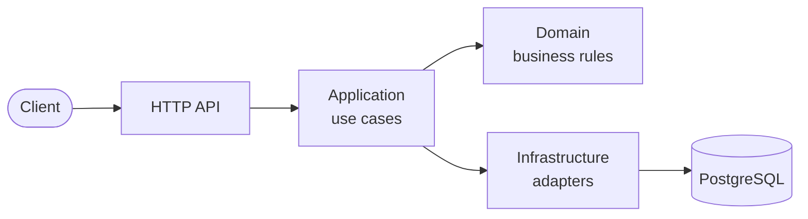

# Pricewright API

> Multi-tenant B2B quote-to-order API: transparent pricing engine, approval workflow and full audit trail.

[](https://github.com/odvprogra/pricewright-api/actions/workflows/ci.yml)
[](.python-version)
[](LICENSE)

<!--
README structure: HANDBOOK §11 (https://github.com/odvprogra/engineering-standards/blob/v1/HANDBOOK.md).
Replace every comment block; keep the section order.
-->

## Demo

<!-- Live URL and/or a GIF. Demo credentials if there are any. -->

## The problem

<!-- Business context in 3–5 sentences: who has the problem and what it costs them today. -->

## What it does

<!-- Key features as a short list. -->

## Architecture



Hexagonal-lite: dependencies point inward, the domain is pure Python, and an architecture test
enforces both. Details in [docs/architecture.md](docs/architecture.md).

## Key decisions

| Decision | Why |
| --- | --- |
| [ADR-0001](docs/adr/0001-record-architecture-decisions.md) Hexagonal-lite, decisions recorded as ADRs | Business rules testable without infrastructure; reasons survive the people who made them |

## Run it locally

Requires [uv](https://docs.astral.sh/uv/) and [just](https://just.systems/), plus Docker.

```sh
just setup   # dependencies, git hooks, openapi.json
just dev     # PostgreSQL in Docker + migrations, then the API on http://localhost:8000 (docs at /docs)
just check   # lint, types and tests: what CI runs
```

Configuration comes from environment variables; [.env.example](.env.example) documents them.

## Testing strategy

| Level | Location | What it covers |
| --- | --- | --- |
| Unit | `tests/unit` | Domain rules and application use cases, no I/O |
| Architecture | `tests/architecture` | Import contracts: dependencies point inward, the domain is pure |
| Integration | `tests/integration` | Adapters against a real PostgreSQL (testcontainers); migrations reversible and in sync |
| API | `tests/e2e` | HTTP behavior: Problem Details, request IDs, health, OpenAPI drift |

`just test` runs everything with coverage (gate: 80% overall, 95% on the domain in CI).
Integration tests need Docker; `just test -m "not integration"` skips them.

## Project structure

```text
src/pricewright/
├── domain/          # business rules, pure Python
├── application/     # use cases and ports
├── infrastructure/  # adapters: logging, database
├── api/             # FastAPI app, Problem Details, middleware, health
├── settings.py      # configuration from the environment
└── main.py          # composition root
tests/               # unit, architecture, integration, e2e
migrations/          # Alembic
docs/                # architecture and ADRs
```

## Trade-offs & what I'd do next

<!-- Honest limitations and next steps. The strongest signal of judgment in the whole README. -->

## License

[MIT](LICENSE)
