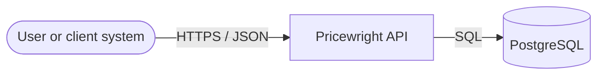
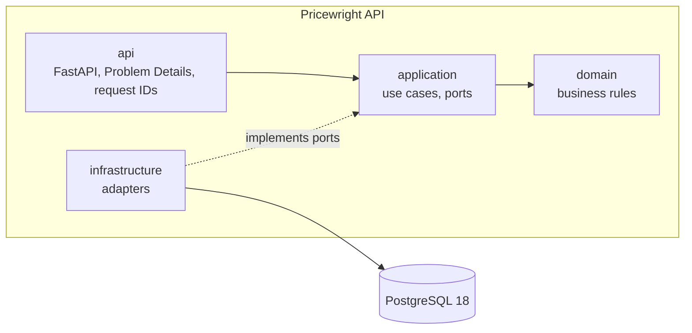

# Architecture

<!-- C4-style views (https://c4model.com): extend these diagrams as the service grows. -->

## Context

Who uses Pricewright API and which systems it talks to.

## Containers

## Rules

- Dependencies point inward; the domain imports no framework or infrastructure library. Enforced by
  the import contracts in `pyproject.toml` (`tests/architecture`).
- Configuration is read only in `main.py` (the composition root) and passed in.
- Every log line is structured JSON with a `request_id` when one exists.
