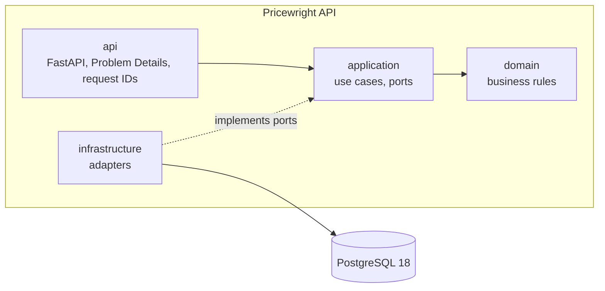
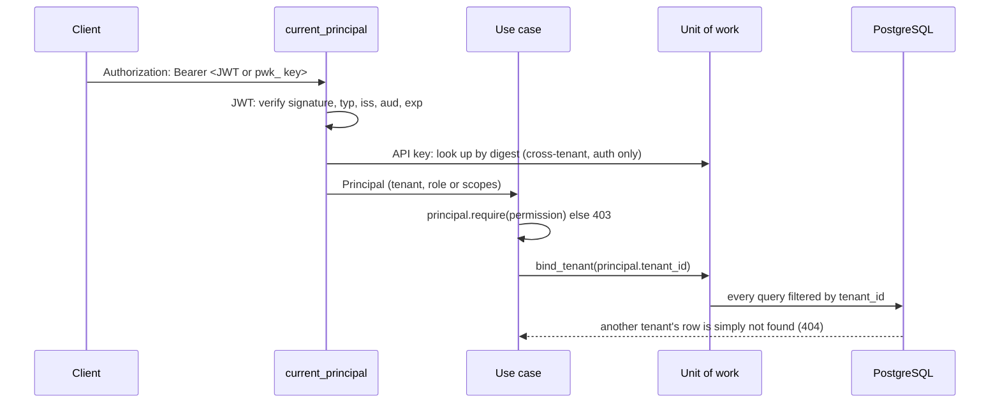
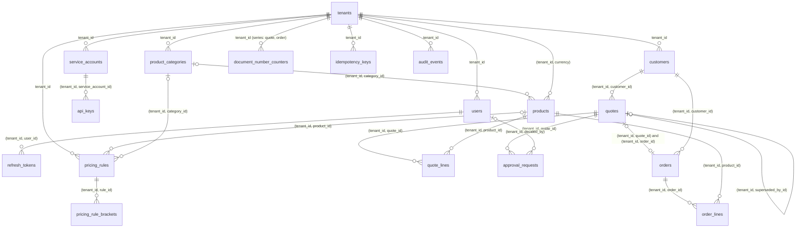
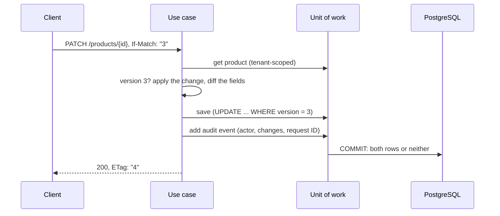
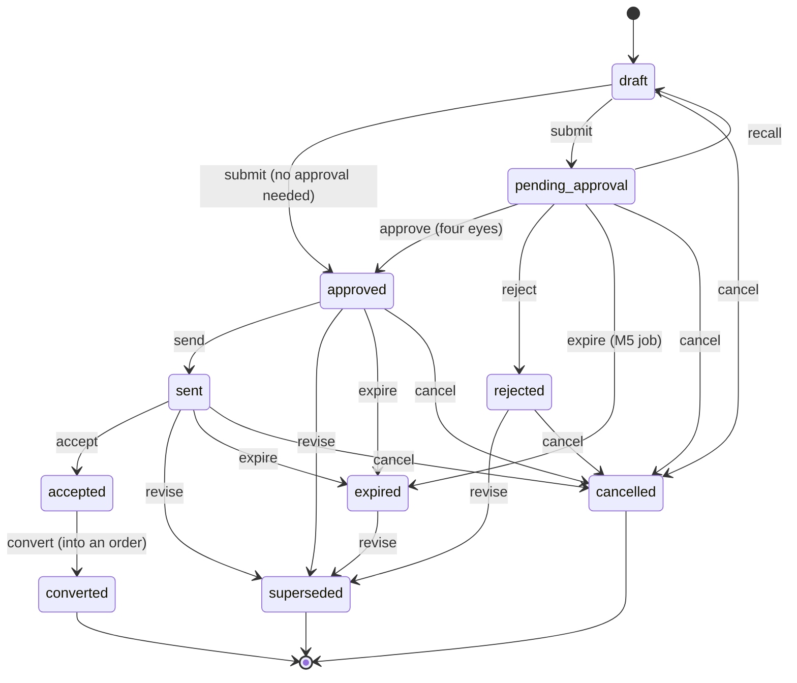

# Architecture

<!-- C4-style views (https://c4model.com): extend these diagrams as the service grows. -->

## Context

Who uses Pricewright API and which systems it talks to. Every client depends on a released
`openapi.json`, never on this repository's code or database
([ADR-0002](adr/0002-separate-repos-with-a-versioned-openapi-contract.md)).


## Containers



## Who is calling, and which tenant

Every request is authenticated, authorized and scoped before any data is read.



## Data

Every tenant-owned table carries `tenant_id`; children point to parents with composite keys, so a
row can never reference another tenant's row (ADR-0006). Prices also carry the currency, tied to the
tenant's by a composite key (ADR-0003). Products and customers are archived, never deleted
(ADR-0016); pricing rules are deactivated or end-dated (ADR-0018); quotes are cancelled or
superseded, never deleted, and each revision links to the next (ADR-0005); a converted quote and its
order link both ways, and orders are cancelled, never deleted (ADR-0023); audit events are
append-only (ADR-0013). Idempotency keys belong to a tenant and a caller and point to what they
created without a foreign key, like audit events (ADR-0022).



## Changing a record

A change and its audit event commit together or not at all (ADR-0013); a stale `If-Match` loses the
compare-and-set (ADR-0012).



## Pricing a quote

The engine is a pure function (ADR-0004): the use case loads what it needs, the domain prices it,
and the response leaves out margins for callers without `costs:read` (ADR-0017).

```mermaid
sequenceDiagram
    participant C as Client
    participant U as preview_prices
    participant W as Unit of work
    participant E as price_quote (domain)
    C->>U: POST /pricing/preview (customer, lines, priced_at?)
    U->>W: tenant settings, customer, products by id
    U->>W: rules effective at priced_at (default: now)
    U->>E: customer, lines, settings, rules
    E->>E: per line: volume tier → customer tier → promotion → override
    E->>E: best rule per stage; unit price rounded to 4 places at each step
    E->>E: line totals, tax once on the subtotal (minor units, half up)
    E->>E: margin floor guard, value-weighted discount, approval reasons
    E-->>U: priced quote with a breakdown per line
    U-->>C: 200, margins only with costs:read
```

## A quote's life

Statuses and moves come from one transition table (ADR-0005). Only drafts change; every change to a
draft's lines reprices all of them, and submitting freezes the prices (ADR-0019). An offer in flight
past its `valid_until` acts as `expired` before any job persists it.



`revise` supersedes the revision with a new draft that keeps the number (`NF-2026-000123-R2`).
Approving needs `quotes:approve`, and the decider never built the revision (ADR-0020).

## Converting a quote, once

An accepted quote becomes an order that copies its snapshot unchanged (ADR-0023). The
`Idempotency-Key` is looked up before the quote's version, so a retry that lost the first response
gets the same order back instead of a 412 (ADR-0022); everything commits together or not at all.

```mermaid
sequenceDiagram
    participant C as Client
    participant U as convert_quote
    participant W as Unit of work
    participant DB as PostgreSQL
    C->>U: POST /quotes/{id}/convert, If-Match "4", Idempotency-Key "k"
    U->>W: claim "k" for this caller
    W->>DB: pg_try_advisory_xact_lock (held by another request: 409 at once)
    DB-->>U: an order "k" created? then 201 with it, Idempotent-Replayed
    U->>W: the quote at version 4 (else 412), its customer
    U->>W: next number of the tenant's order series
    U->>U: quote.convert: accepted only; lines, prices, tax copied
    U->>W: save the quote (compare-and-set), add the order
    U->>W: audit quote.converted and order.created; remember "k"
    W->>DB: COMMIT: all of it or nothing; the lock ends
    U-->>C: 201, Location /orders/{id}, ETag "1"
```

## Rules

- Dependencies point inward; the domain imports no framework or infrastructure library. Enforced by
  the import contracts in `pyproject.toml` (`tests/architecture`).
- Configuration is read only in `main.py` (the composition root) and passed in.
- Every log line is structured JSON with a `request_id` when one exists.
- Authorization is by permission (`resource:action`), never by role name; service accounts hold
  scopes, never the permissions reserved for people (administration, the audit trail, catalog and
  pricing changes, costs, sending, approving and overriding quotes, converting them into orders and
  cancelling those) (ADR-0007, ADR-0017, ADR-0023).
- Creations take an optional `Idempotency-Key`, checked first and remembered in the same unit of
  work as what it created; a retry gets that resource back (ADR-0022).
- Every change appends its audit event in the same unit of work (ADR-0013).
- Lists filter and sort through whitelisted parameters and page with keyset cursors bound to the
  query (ADR-0014).
- Money is a `Decimal` with its currency, never a float, and travels as a decimal string (ADR-0003).
- Prices are computed only by the pricing engine, a pure function of the rules (ADR-0004); quotes
  keep its result as a snapshot and never recompute it once submitted (ADR-0019); orders copy it
  unchanged (ADR-0023).
- Quotes move only through the transition table (ADR-0005); nobody approves a quote they built, and
  approving, sending and overriding prices stay with people (ADR-0020).
- Use cases bind the unit of work to the caller's tenant; only authentication reads across tenants
  (ADR-0006).
