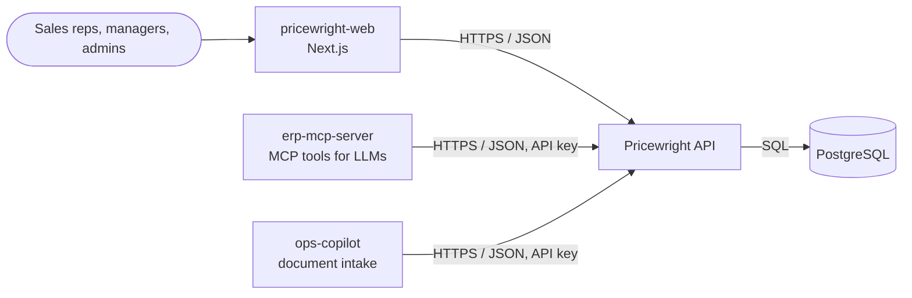
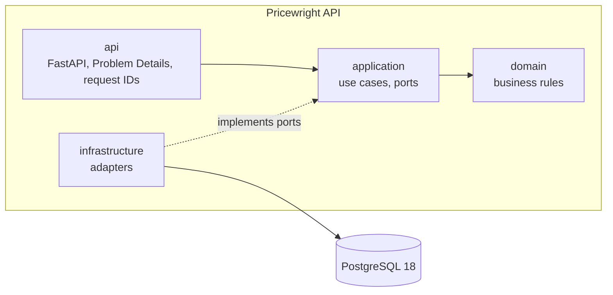
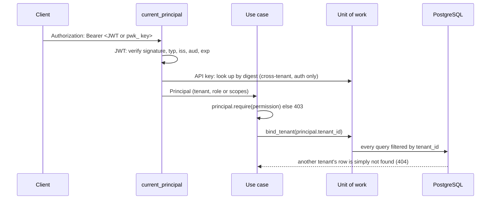
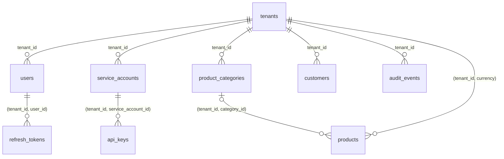
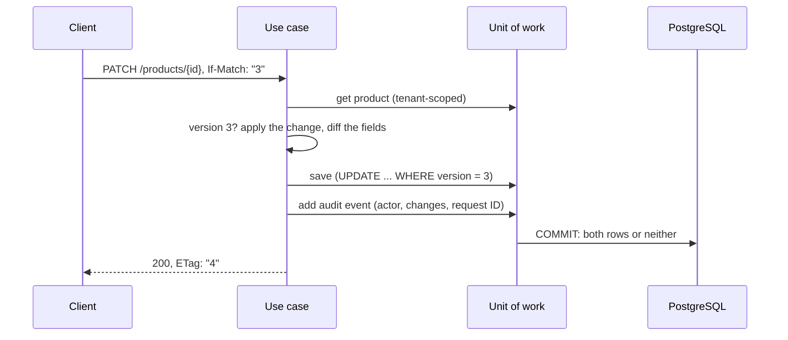

# Architecture

<!-- C4-style views (https://c4model.com): extend these diagrams as the service grows. -->

## Context

Who uses Pricewright API and which systems it talks to. Every client depends on a released
`openapi.json`, never on this repository's code or database
([ADR-0002](adr/0002-separate-repos-with-a-versioned-openapi-contract.md)).

## Containers

## Who is calling, and which tenant

Every request is authenticated, authorized and scoped before any data is read.

## Data

Every tenant-owned table carries `tenant_id`; children point to parents with composite keys, so a
row can never reference another tenant's row (ADR-0006). Prices also carry the currency, tied to the
tenant's by a composite key (ADR-0003). Products and customers are archived, never deleted
(ADR-0016); audit events are append-only (ADR-0013).

## Changing a record

A change and its audit event commit together or not at all (ADR-0013); a stale `If-Match` loses the
compare-and-set (ADR-0012).

## Rules

- Dependencies point inward; the domain imports no framework or infrastructure library. Enforced by
  the import contracts in `pyproject.toml` (`tests/architecture`).
- Configuration is read only in `main.py` (the composition root) and passed in.
- Every log line is structured JSON with a `request_id` when one exists.
- Authorization is by permission (`resource:action`), never by role name; service accounts hold
  scopes, never the permissions reserved for people (administration, the audit trail, catalog
  changes, costs) (ADR-0007, ADR-0017).
- Every change appends its audit event in the same unit of work (ADR-0013).
- Lists filter and sort through whitelisted parameters and page with keyset cursors bound to the
  query (ADR-0014).
- Money is a `Decimal` with its currency, never a float, and travels as a decimal string (ADR-0003).
- Use cases bind the unit of work to the caller's tenant; only authentication reads across tenants
  (ADR-0006).
