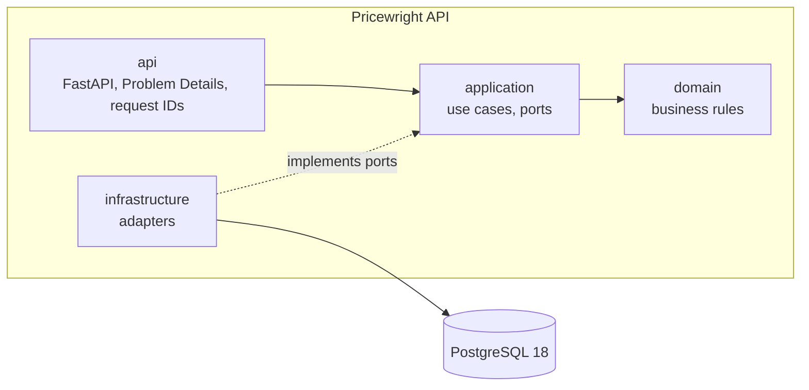
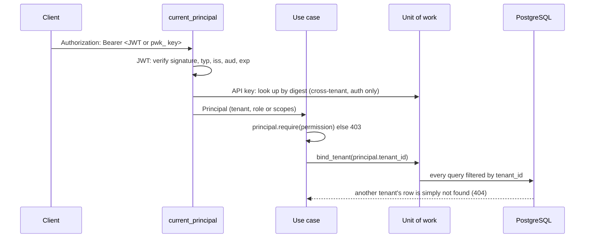

# Architecture

<!-- C4-style views (https://c4model.com): extend these diagrams as the service grows. -->

## Context

Who uses Pricewright API and which systems it talks to. Every client depends on a released
`openapi.json`, never on this repository's code or database
([ADR-0002](adr/0002-separate-repos-with-a-versioned-openapi-contract.md)).

## Containers

## Who is calling, and which tenant

Every request is authenticated, authorized and scoped before any data is read.

## Rules

- Dependencies point inward; the domain imports no framework or infrastructure library. Enforced by
  the import contracts in `pyproject.toml` (`tests/architecture`).
- Configuration is read only in `main.py` (the composition root) and passed in.
- Every log line is structured JSON with a `request_id` when one exists.
- Authorization is by permission (`resource:action`), never by role name; service accounts hold
  non-administrative permissions as scopes (ADR-0007).
- Use cases bind the unit of work to the caller's tenant; only authentication reads across tenants
  (ADR-0006).
